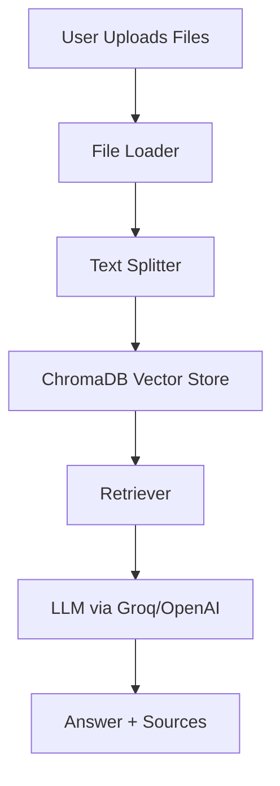

<div align="center">
  
</div>


[](https://www.python.org/)
[](https://streamlit.io/)
[](https://www.langchain.com/)
[](https://www.trychroma.com/)
[](LICENSE)


A **Retrieval-Augmented Generation (RAG)** assistant for interactive document-based Question Answering.  
Upload PDFs, DOCX, TXT, Markdown, or JSON files, and interact with them via **Streamlit UI**, **CLI**, or **FastAPI API**.

---

## 🚀 Features

- 📂 **Multi-format ingestion**: PDF, DOCX, TXT, MD, JSON  
- ✂️ **Smart text splitting** with overlapping chunks  
- 🧠 **Vector embeddings** using SentenceTransformers  
- 🗂 **ChromaDB persistence** for long-term storage  
- 🤖 **LLM providers**: Groq & OpenAI  
- 🖥 **Multiple interfaces**: Streamlit UI, CLI, FastAPI  
- 📝 **Config-driven** via `config.yaml`  
- 🔎 **Source citation** for transparency  

---
## ⚡ Quick Start (5 Minutes)

1. **Clone and Install**
```
git clone https://github.com/ak-rahul/RAG-Assistant.git
cd RAG-Assistant
pip install -r requirements.txt
```

2. **Set API Key**
```
echo "GROQ_API_KEY=your_key_here" > .env
```

💡 Get free key at: https://console.groq.com/

3. **Run the App**
```
python cli.py web
```

4. **Try the Sample**
- We included `data/sample.txt` to get started
- Ask: "What is RAG?" or "List the benefits"
- Upload your own documents and explore!

📚 More examples in [examples/](examples/)

---
## 📸 Screenshots


*Upload and process documents*


*Get answers with cited sources*

---

## 📂 Project Structure

```bash
rag-assistant/
│
├── app.py                 # Streamlit UI
├── cli.py                 # CLI entrypoint
├── config.yaml            # Config file
├── requirements.txt       # Dependencies
├── scripts/               # Helper scripts
│   ├── rag.sh 
│   └── rag.bat
├── src/
│   ├── config.py
│   ├── logger.py
│   ├── server.py          # FastAPI app
│   ├── pipeline/
│   │   └── rag_pipeline.py
│   ├── db/
│   │   └── chroma_handler.py
│   ├── ingestion/
│   │   └── ingest.py
│   └── utils/
│       ├── file_loader.py
│       └── text_splitter.py
│
├── data/                  # Uploaded docs
├── logs/                  # Logs
└── README.md
```

---

## ⚙️ Configuration

config.yaml controls everything:

```bash
data:
  source_dir: "./data"
  allowed_ext: [".pdf", ".docx", ".txt", ".md", ".json"]

vector_store:
  persist_directory: "./.chroma"
  embedding_model: "sentence-transformers/all-MiniLM-L6-v2"
  top_k: 4

ingestion:
  chunk_size: 1200
  chunk_overlap: 150

llm:
  provider: groq
  model: llama-3.1-8b-instant 
  temperature: 0.2
  max_tokens: 512
```

🔑 Environment overrides via .env: 

``` bash
GROQ_API_KEY=...
OPENAI_API_KEY=...
```
---

## 📋 Prerequisites

- Python 3.9 or higher [attached_file:1][attached_file:2]
- Groq API key (free tier available at [console.groq.com](https://console.groq.com/))
- 2GB disk space for vector embeddings
- (Optional) OpenAI API key for alternative LLM

---

## ⚙️ Setup

### 1. Clone the Repository
```bash
git clone https://github.com/ak-rahul/rag-assistant.git
cd rag-assistant
```
### 2. Create Virtual Environment
```bash
python -m venv .venv
source .venv/bin/activate   # (Linux/Mac)
.venv\Scripts\activate      # (Windows)
```

### 3. Install Dependencies
```bash
pip install -r requirements.txt
```

### 4. Configure Environment
Create a .env file in the project root:
```bash
GROQ_API_KEY=your_groq_api_key
OPENAI_API_KEY=your_openai_api_key   # optional
```

---

## 🖥 Usage

### Web UI

Launch the Streamlit UI:
```bash
python cli.py web
```

- Upload documents in the sidebar

- Ask questions in the chat interface

- Inspect DB stats or clear DB

### CLI

Ingest Documents
```bash
python cli.py ingest
```

Query
```bash
python cli.py query "What is Kali Linux?"
```

Run API Server
```bash
python cli.py serve
```

Show DB Stats
```bash
python cli.py stats
```

Clear DB
```bash
python cli.py clear
```

---

## 🧩 Architecture

---

## 🧾 Example Workflow

- Upload a PDF in the Streamlit sidebar
- The file is chunked and ingested into ChromaDB
- Ask a question like:
  - "What is covered in Chapter 2 of the Kali Linux PDF?"
- The system retrieves relevant chunks → sends them to the LLM → returns an answer with sources

---

## 📊 Vector Store Management

- All documents are persisted in ChromaDB inside ./.chroma
- You can check stats (total docs, embeddings, metadata)
- Use Clear DB to reset your database

---

## ❓ Troubleshooting

**GROQ_API_KEY not set**  : Create .env file with your API key
```
echo "GROQ_API_KEY=gsk_your_key" > .env
```

**ChromaDB errors**
```
python cli.py clear # Clear database
python cli.py ingest # Re-ingest documents
```

**No documents found**
- Ensure files are in `./data` folder
- Run `python cli.py ingest`

**Slow responses**
- Reduce `top_k` in `config.yaml` (4 → 2)

**Need help?** [Open an issue](https://github.com/ak-rahul/RAG-Assistant/issues)


---

## 🛠 Tech Stack

- **Python 3.9+**  
- [Streamlit](https://streamlit.io/) – Web UI  
- [LangChain](https://www.langchain.com/) – RAG pipeline  
- [ChromaDB](https://www.trychroma.com/) – Vector store  
- [Groq LLM](https://console.groq.com/) – LLM provider  
- [OpenAI (optional)](https://platform.openai.com/) – Alternative LLM provider  

---

## 📝 License

This project is licensed under the [MIT License](LICENSE).
